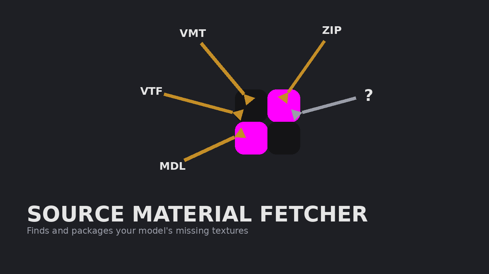

# Source Material Fetcher (v0.1 — core pipeline)



[](https://github.com/ellemti/MDL_Source_Material_Fetcher/actions/workflows/build.yml)
[](LICENSE)

By **Anas** ([ellemti](https://ellemti.artstation.com)) — freelance 3D artist and level creator (Blender / Source Engine).

Finds every `.vmt`/`.vtf` material dependency of one or more Source
Engine `.mdl` models and packages them into a ZIP, preserving the
`materials/...` folder structure.

Pipeline: **MDL → parse materials → resolve VMT/VTF in your configured
folders → copy with structure preserved → ZIP**

## Known limitations to keep in mind

- QC-only textures (referenced in the source `.qc` but not embedded
  in the compiled `.mdl`) can't be seen by this tool — that's a
  hard limit of working from the compiled model.
- If the same material exists in two different Search Locations, the
  **first matching folder in your list wins** — order your Search
  Locations by priority.
- The MDL parser targets versions 44–49. Very old (HL2 launch era,
  <44) or unusual custom-versioned MDLs may fail to parse; you'll get
  a clear error rather than a wrong/partial result.

## What's in this build

- `.mdl` binary parser (MDL versions 44–49 — offsets taken directly
  from Valve's public `studiohdr_t` definition, not guessed)
- Full VMT parser: every common `$texture` shader parameter (not just
  `$basetexture`), plus recursive `patch`/`include` VMT handling
- Recursive dependency resolution against plain folders you add as
  "Search Locations" (e.g. your `GarrysMod/garrysmod` folder, or an
  extracted addon)
- Dark-themed PySide6 GUI with drag-and-drop `.mdl` input, an
  Analyze/Fetch split, and a report of found vs. missing files
- Menu bar (File / Help), status bar with a live progress indicator,
  per-model status icons (✓ / ⚠ / ✗) in the model list, a
  color-coded report (green/yellow/red), and Copy Report / Open
  Output Folder shortcuts
- **Built-in updater**: checks GitHub Releases on startup and via
  Help → Check for Updates. If a newer release exists, an "Update
  available" button lights up in the status bar — click it and the
  app downloads the new `.exe`, swaps itself out, and relaunches
  automatically. See [Automatic Updates](#automatic-updates) below.
- Window size/position and search folders remembered between runs
- App icon (`assets/icon.png` / `icon.ico`) shown in the window, next
  to the app title, in the built `.exe`, and in the taskbar
- Your GitHub and ArtStation links in the Help menu, the About
  dialog, and a small footer in the app itself
- Settings (search folders, last output dir, window geometry)
  persisted to `SourceMaterialFetcher_Settings.json` next to the exe
- A `pytest` regression suite covering the parser and the full
  resolve → copy → zip pipeline, run automatically in CI

## Roadmap

- [ ] VPK archive scanning — right now, Search Locations must be
      extracted folders on disk, not `.vpk` files.
- [ ] Automatic Steam library / installed-game detection — for now,
      add each game/addon folder manually via "Add Folder...".
- [ ] Skin-group / texture-group awareness (materials only reachable
      via a non-default skin aren't currently flagged separately).

`resolver.py` is written so a VPK-backed search root can be added
alongside the folder-based one without changing the MDL/VMT parsing
logic.

## Automatic Updates

The app checks `https://github.com/<owner>/<repo>/releases/latest`
(the values are set in `core/version.py` — `GITHUB_OWNER` /
`GITHUB_REPO`) on startup, silently. If a release with a higher
version tag exists **and has a `SourceMaterialFetcher.exe` file
attached**, an "Update available" button appears in the status bar.
Clicking it downloads that exe, waits for the app to close, swaps
the file in, and relaunches — no manual download needed. This only
installs automatically when running the built `.exe`; running via
`python main.py` will tell you a new version exists but link you to
the Releases page instead.

**This only works once you've actually published this on GitHub** —
see the next section for the one-time setup, and "Cutting a Release"
for how each update gets published.

## Posting this on GitHub (one-time setup)

The values are already correct for this repo (`ellemti` /
`MDL_Source_Material_Fetcher` in `core/version.py`) — nothing to
edit there. Steps:

1. **Repo already created?** If you created it on github.com with
   README/.gitignore/license left as **None**, skip to step 2. If you
   let GitHub generate a README, you'll get a merge conflict on first
   push — run `git pull origin main --allow-unrelated-histories` and
   resolve it before continuing.
2. **Push it**, from inside this folder:
   ```
   git init
   git add .
   git commit -m "Initial commit"
   git branch -M main
   git remote add origin https://github.com/ellemti/MDL_Source_Material_Fetcher.git
   git push -u origin main
   ```
3. **Repo "About" settings** (gear icon next to About, top-right of
   the repo page):
   - **Description**: *"Finds and packages all .vmt/.vtf material
     dependencies of a Source Engine .mdl model into a ZIP."*
   - **Website**: your portfolio link, e.g. `ellemti.artstation.com`
   - **Topics**: `source-engine`, `gmod`, `garrys-mod`, `valve`,
     `modding`, `python`, `pyside6`, `mdl-parser`
4. GitHub will auto-detect the `LICENSE` file and show "MIT License"
   on the repo page automatically.

## Cutting a Release (this is what the updater actually downloads)

Every time you want to ship an update:

1. Bump the version in `core/version.py` (`APP_VERSION = "0.2.0"`).
2. Commit and push that change to `main`.
3. Tag and push the tag — the tag **must** start with `v` and match
   the version you set:
   ```
   git tag v0.2.0
   git push origin v0.2.0
   ```
4. That's it. `.github/workflows/release.yml` picks up the tag,
   builds the exe on a clean Windows runner, runs the tests, and
   publishes a GitHub Release named `v0.2.0` with
   `SourceMaterialFetcher.exe` attached. Watch it run under the
   repo's **Actions** tab.
5. Anyone running an older build will see "Update available: v0.2.0"
   next time they open the app (or use Help → Check for Updates).

## What gets published on each Release

Pushing a version tag (like `v0.2.0`) makes GitHub build and attach 3 files:

| File | For |
|------|-----|
| `SourceMaterialFetcher-Setup-<version>.exe` | **Installer** — Start Menu shortcut, optional desktop shortcut, uninstaller. Installs for the current user only (no admin needed), so the in-app updater keeps working. |
| `SourceMaterialFetcher-<version>-portable.zip` | **Portable** — unzip anywhere and run, nothing gets installed. |
| `SourceMaterialFetcher.exe` | The plain exe. **Don't rename or remove it** — the in-app "Update available" button downloads this file. |

Windows may show a "SmartScreen / unknown publisher" warning on first
run. That's normal for any app that isn't paid-code-signed; click
*More info → Run anyway*.

## Running it

You need Python 3.11+ on Windows.

```
pip install -r requirements.txt
python main.py
```

## Running the tests

```
pip install pytest
pytest -v
```

## Building the standalone .exe

This has to be built **on Windows** (PyInstaller doesn't
cross-compile from Linux/Mac to Windows).

Double-click **`UPDATE.bat`** (first run also creates the `.venv`).
It rebuilds from whatever code is in the folder and puts the finished
exe in **one place**: `release\SourceMaterialFetcher.exe`. The
temporary `build\` and `dist\` folders are deleted afterward.
(`build_exe.bat` just calls `UPDATE.bat`.)

### What goes on GitHub, and where

- **The repo (`git push`)**: source only. Never commit the exe or the
  `release\`, `build\`, `dist\` folders — they're git-ignored on
  purpose. Binaries are 50-100 MB, GitHub rejects files over 100 MB,
  and every committed rebuild stays in the repo history forever.
- **The Releases page**: the built exe. Easiest is pushing a version
  tag and letting `.github/workflows/release.yml` build and publish it
  (see "Cutting a Release"). To upload by hand instead: repo →
  Releases → *Draft a new release* → pick/create a tag like `v0.1.0`
  → drag in `release\SourceMaterialFetcher.exe` → Publish. Keep the
  filename exactly `SourceMaterialFetcher.exe`, since the in-app
  updater looks for that name.

## Optimizations

- **Build size / startup**: the build uses a single curated
  `SourceMaterialFetcher.spec` (instead of ad-hoc flags repeated across
  4 scripts) that excludes ~25 Qt modules the app never touches
  (WebEngine, Qml/Quick, Multimedia, Sql, Charts, etc.). Less to bundle
  means less to self-extract on every `--onefile` launch.
- **Scan speed**: `resolver.py` skips its case-insensitive directory
  walk entirely on Windows, since NTFS is already case-insensitive —
  that walk was previously running on every *missing* file lookup
  (the common case), which adds up fast in a large addons folder.
- **Concurrent resolution**: analyzing multiple `.mdl` files now runs
  on a thread pool (`core/pipeline.py`) instead of one at a time —
  resolution is I/O-bound (file checks, small text reads), so this is
  a real speedup on multi-model batches with no added complexity for
  the caller.
- **Architecture**: the MDL → resolve → package orchestration used to
  live inside the GUI's `Worker` class, coupled to Qt. It's now
  `core/pipeline.run_pipeline()` — plain Python, directly unit-tested
  (see `tests/test_pipeline.py`), and reusable outside the GUI. A
  parse error in one model no longer aborts the whole batch — it's
  reported per-model and the rest continue.

## Project layout

```
SourceMaterialFetcher/
  main.py                     GUI (PySide6)
  core/
    mdl_parser.py              Reads .mdl -> material names + cdmaterials dirs
    vmt_parser.py               Reads .vmt -> shader + referenced textures, handles patch/include
    resolver.py                  Searches configured folders, recursively resolves everything
    pipeline.py                   Orchestrates MDL->resolve->package, concurrently, UI-agnostic
    packager.py                    Copies files + builds the ZIP
    settings.py                     Loads/saves SourceMaterialFetcher_Settings.json
    updater.py                       Checks/downloads/applies updates from GitHub Releases
    version.py                        App name/version, GitHub + ArtStation links
  assets/
    generate_icon.py             Regenerates icon.png/icon.ico/banner.png
  tests/
    test_pipeline.py               pytest regression suite
  .github/workflows/
    build.yml                       CI: test + build the .exe on every push
    release.yml                      Builds + publishes a GitHub Release on a version tag
  SourceMaterialFetcher.spec    PyInstaller build config (single source of truth)
  requirements.txt
  build_exe.bat / UPDATE.bat
  LICENSE
```

## Credits & Acknowledgments

- **Valve Corporation** — the `.mdl` parser's field offsets were
  derived directly from the public `studiohdr_t` definition in
  Valve's [source-sdk-2013](https://github.com/ValveSoftware/source-sdk-2013)
  (`public/studio.h`). No SDK code is included in this repo; the
  header was only read as a reference to get the byte layout right.
- **[PySide6](https://pypi.org/project/PySide6/)** (Qt for Python,
  LGPL) — the GUI framework.
- **[PyInstaller](https://pyinstaller.org/)** — used to build the
  standalone `.exe`.

## Disclaimer

This is an unofficial, fan-made tool for working with Source Engine
content you already own or have rights to use. It is not affiliated
with, endorsed by, or sponsored by Valve Corporation. "Source",
"Source Engine", and related marks are trademarks of Valve
Corporation.

## License

MIT — see [LICENSE](LICENSE). This covers the code in this repo only;
it does not grant any rights to Valve's Source Engine SDK, game
content, or trademarks.
